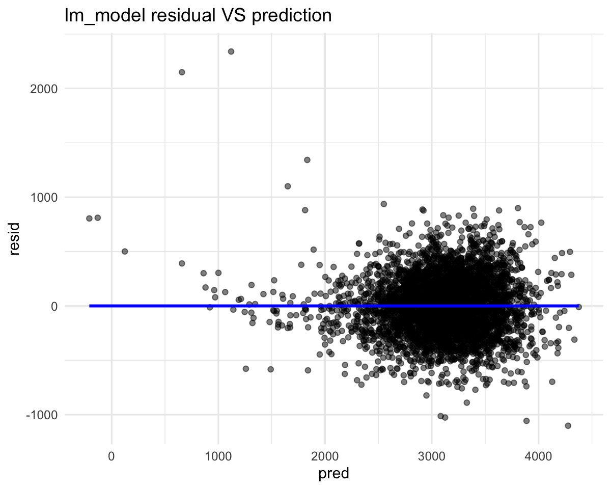
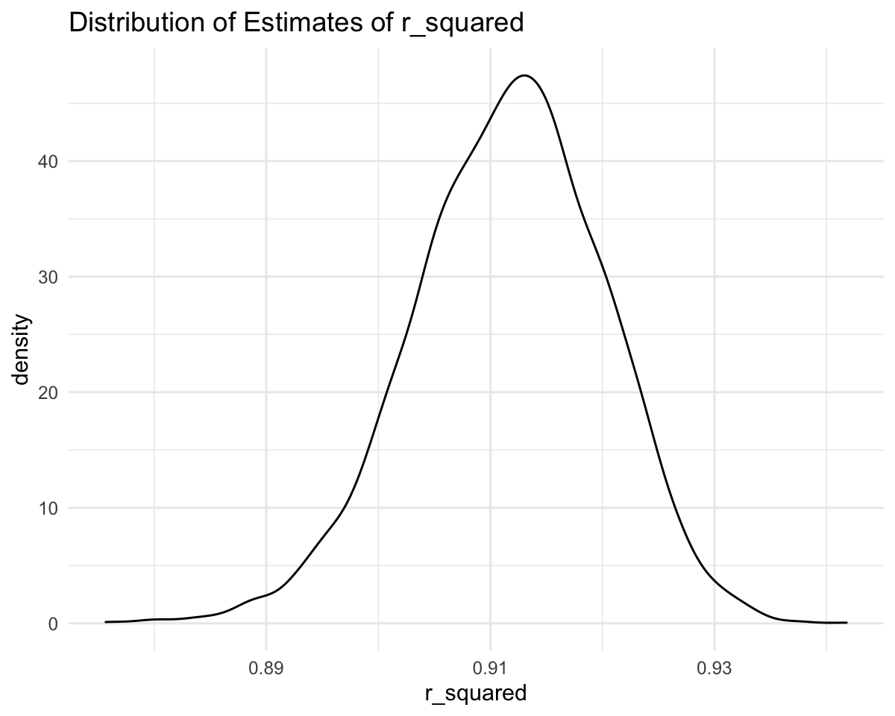

p8108\_hw6\_yl4925
================
Yiming Li
12/3/2021

``` r
library(tidyverse)
library(modelr)
library(mgcv)
```

``` r
birthweight_df = read.csv("./data/birthweight.csv") %>% 
  janitor::clean_names() 
```

``` r
birthweight_df %>% 
  filter(is.na(rowSums(birthweight_df)))
```

    ##  [1] babysex  bhead    blength  bwt      delwt    fincome  frace    gaweeks 
    ##  [9] malform  menarche mheight  momage   mrace    parity   pnumlbw  pnumsga 
    ## [17] ppbmi    ppwt     smoken   wtgain  
    ## <0 rows> (or 0-length row.names)

There is no missing value.

``` r
fct_birthweight_df = birthweight_df %>% 
  mutate(babysex = case_when(
    babysex == 1 ~ "male",
    babysex == 2 ~ "female"
  ), frace = case_when(
    frace == 1 ~ "white",
    frace == 2 ~ "black",
    frace == 3 ~ "asian",
    frace == 4 ~ "puerto_rican",
    frace == 8 ~ "other",
    frace == 9 ~ "unknown",
  ), mrace = case_when(
    mrace == 1 ~ "white",
    mrace == 2 ~ "black",
    mrace == 3 ~ "asian",
    mrace == 4 ~ "puerto_rican",
    mrace == 8 ~ "other"
  )) %>% 
  mutate(babysex = fct_infreq(babysex), 
         frace = fct_infreq(frace),
         mrace = fct_infreq(mrace))
```

``` r
original_fit = lm(bwt ~ babysex + bhead + blength + delwt + fincome + frace + gaweeks + 
                    malform + menarche + mheight + momage + mrace + parity + pnumlbw + 
                    pnumsga + ppbmi + ppwt + smoken + wtgain, data = fct_birthweight_df)
```

``` r
original_fit_df = original_fit %>% broom::tidy() 
original_fit_df %>% 
  filter(is.na(rowSums(select(original_fit_df, -term)))) %>% 
  select(term) %>% 
  knitr::kable()
```

| term    |
|:--------|
| pnumlbw |
| pnumsga |
| wtgain  |

We find there are three NA coefficients, which means that these three
variables could be linear combination of other variables, so we do not
choose these three variables as predictors.

``` r
original_fit_df %>% 
  filter(p.value > 0.05) %>% 
  select(term, estimate, p.value) %>% 
  knitr::kable()
```

| term               |    estimate |   p.value |
|:-------------------|------------:|----------:|
| fincome            |   0.2898207 | 0.1065513 |
| fraceblack         |  14.3312853 | 0.7561682 |
| fracepuerto\_rican | -46.9962310 | 0.2929123 |
| fraceasian         |  21.2361118 | 0.7592729 |
| fraceother         |   4.2969242 | 0.9537446 |
| malform            |   9.7649680 | 0.8900388 |
| menarche           |  -3.5507723 | 0.2200827 |
| mheight            |   9.7874130 | 0.3425881 |
| momage             |   0.7593479 | 0.5344182 |
| mracepuerto\_rican | -56.4787268 | 0.2109013 |
| mraceasian         | -91.3866079 | 0.2039079 |
| ppbmi              |   4.3537865 | 0.7700173 |
| ppwt               |  -3.4715550 | 0.1839131 |

The p values for these 13 variables are greater than 0.05, which means
that we could not reject null hypothesis (coefficient is zero). But for
mrace variable, some values of this variable are necessary (p value &lt;
0.05). So we remain these two variables and only exclude frace (only the
p value for “unknown” &lt; 0.05), fincome, malform, menarche, mheight,
momage, ppbmi and ppwt.

``` r
better_fit = lm(bwt ~ babysex + bhead + blength + delwt + gaweeks + mrace + 
                  parity + ppbmi + ppwt + smoken , data = fct_birthweight_df)
```

``` r
better_fit %>% 
  broom::tidy()
```

    ## # A tibble: 13 × 5
    ##    term               estimate std.error statistic   p.value
    ##    <chr>                 <dbl>     <dbl>     <dbl>     <dbl>
    ##  1 (Intercept)       -5670.      101.       -56.1  0        
    ##  2 babysexfemale        28.4       8.46       3.35 8.02e-  4
    ##  3 bhead               131.        3.45      38.0  1.49e-273
    ##  4 blength              74.8       2.02      37.1  1.23e-261
    ##  5 delwt                 4.09      0.392     10.4  3.90e- 25
    ##  6 gaweeks              11.7       1.46       7.98 1.84e- 15
    ##  7 mraceblack         -146.        9.23     -15.8  1.51e- 54
    ##  8 mracepuerto_rican  -107.       19.1       -5.62 1.99e-  8
    ##  9 mraceasian          -79.5      42.3       -1.88 6.01e-  2
    ## 10 parity               94.4      40.3        2.34 1.94e-  2
    ## 11 ppbmi                -9.58      2.57      -3.73 1.96e-  4
    ## 12 ppwt                 -0.979     0.566     -1.73 8.36e-  2
    ## 13 smoken               -4.88      0.586     -8.33 1.12e- 16

``` r
fct_birthweight_df %>% 
  modelr::add_residuals(better_fit) %>% 
  modelr::add_predictions(better_fit) %>% 
  ggplot(aes(x = pred, y = resid)) + 
  geom_point(alpha = 0.5) + 
  labs(
    title = "lm_model residual VS prediction"
  )
```



``` r
cv_df = 
  crossv_mc(fct_birthweight_df, 100) 
```

``` r
cv_df =
  cv_df %>% 
  mutate(
    train = map(train, as_tibble),
    test = map(test, as_tibble))
```

``` r
cv_df = 
  cv_df %>% 
  mutate(
    my_mod = map(train, ~lm(bwt ~ babysex + bhead + blength + delwt + gaweeks + mrace + 
                  parity + ppbmi + ppwt + smoken , data = .x)),
    len_ges_mod = map(train, ~lm(bwt ~ blength + gaweeks, data = .x)),
    headcir_len_sex_mod = map(train, ~lm(bwt ~ bhead + blength + babysex + 
                                           bhead * blength + bhead * babysex + blength * babysex + 
                                           bhead * blength * babysex, data = .x))) %>% 
  mutate(
    rmse_my = map2_dbl(my_mod, test, ~rmse(model = .x, data = .y)),
    rmse_len_ges = map2_dbl(len_ges_mod, test, ~rmse(model = .x, data = .y)),
    rmse_headcir_len_sex = map2_dbl(headcir_len_sex_mod, test, ~rmse(model = .x, data = .y)))
```

``` r
cv_df %>% 
  select(starts_with("rmse")) %>% 
  pivot_longer(
    everything(),
    names_to = "model", 
    values_to = "rmse",
    names_prefix = "rmse_") %>% 
  mutate(model = fct_inorder(model)) %>% 
  ggplot(aes(x = model, y = rmse)) + geom_violin() +
  labs(
    title = "RMSE for three models"
  )
```


## problem 2

``` r
weather_df = 
  rnoaa::meteo_pull_monitors(
    c("USW00094728"),
    var = c("PRCP", "TMIN", "TMAX"), 
    date_min = "2017-01-01",
    date_max = "2017-12-31") %>%
  mutate(
    name = recode(id, USW00094728 = "CentralPark_NY"),
    tmin = tmin / 10,
    tmax = tmax / 10) %>%
  select(name, id, everything())
```

``` r
log_result_df = weather_df %>% 
  bootstrap(n = 5000) %>% 
  mutate(
    models = map(strap, ~lm(tmax ~ tmin, data = .x) ),
    results = map(models, broom::tidy)) %>% 
  select(-strap, -models) %>% 
  unnest(results) %>% 
  mutate(term = case_when(
    term == "(Intercept)" ~ "beta0",
    term == "tmin" ~ "beta1"
  )) %>% 
  select(.id, term, estimate) %>% 
  pivot_wider(
    names_from = term,
    values_from = estimate
  ) %>% 
  mutate(log = log(beta0 * beta1))
```

``` r
log_result_df %>% 
  ggplot(aes(x = log)) +
  geom_density() +
  labs(
    x = "log(beta0 * beta1)",
    title = "Distribution of Estimates of log(beta0 * beta1)")
```


``` r
log_result_df %>% 
  summarize(
    lower_limit = quantile(log, 0.025),
    upper_limit = quantile(log, 0.975),
    log_mean = mean(log),
    log_se = sd(log)) %>% 
  knitr::kable()
```

| lower\_limit | upper\_limit | log\_mean |   log\_se |
|-------------:|-------------:|----------:|----------:|
|     1.965243 |     2.058933 |   2.01278 | 0.0240216 |

``` r
r_square_result_df = weather_df %>% 
  bootstrap(n = 5000) %>% 
  mutate(
    models = map(strap, ~lm(tmax ~ tmin, data = .x) ),
    results = map(models, broom::glance)) %>% 
  select(-strap, -models) %>% 
  unnest(results) %>% 
  select(.id, r.squared)
```

``` r
r_square_result_df %>% 
  ggplot(aes(x = r.squared)) +
  geom_density() +
  labs(
    x = "r_squared",
    title = "Distribution of Estimates of r_squared")
```



``` r
r_square_result_df %>% 
  summarize(
    lower_limit = quantile(r.squared, 0.025),
    upper_limit = quantile(r.squared, 0.975),
    r_square_mean = mean(r.squared),
    r_square_se = sd(r.squared)) %>% 
  knitr::kable()
```

| lower\_limit | upper\_limit | r\_square\_mean | r\_square\_se |
|-------------:|-------------:|----------------:|--------------:|
|    0.8939748 |    0.9271026 |       0.9114796 |     0.0085105 |
